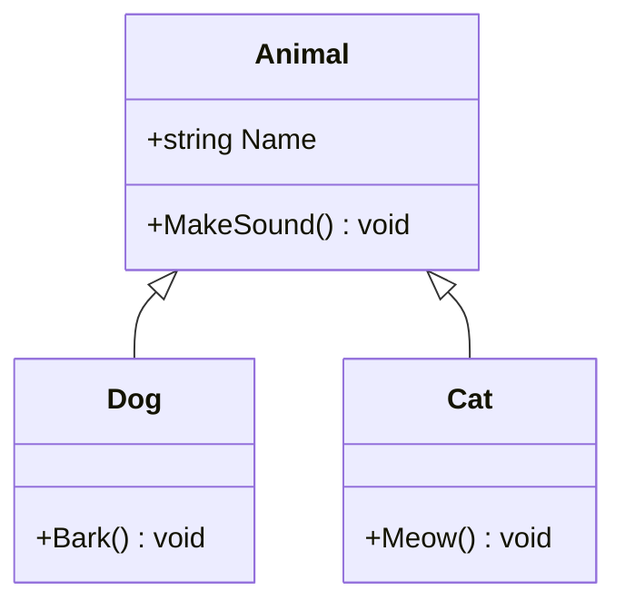

# 26. UML och Klassdiagram

UML (Unified Modeling Language) används för att visualisera kod-strukturer och relationer.

## Klassdiagram Grundläggande

```
┌─────────────────────┐
│      Person         │
├─────────────────────┤
│ - name: string      │
│ - age: int          │
├─────────────────────┤
│ + GetInfo(): string │
└─────────────────────┘
```

- **Övre delen**: Klassnamn
- **Mitten**: Properties och Fields
- **Nedre delen**: Metoder

### Visibility

- `+` Public
- `-` Private
- `#` Protected
- `~` Internal

## Relationer

### Association (Använder)

```
┌──────────┐         ┌──────────┐
│ Customer │────────>│  Order   │
└──────────┘         └──────────┘
   kund       har       order
```

```csharp
public class Customer
{
    public List<Order> Orders { get; set; } = new();
}
```

### Composition (Äger, livstid kopplad)

```
┌──────────┐         ┌──────────┐
│  House   │◆────────│   Room   │
└──────────┘         └──────────┘
   huset     äger      rummen
```

```csharp
public class House
{
    private List<Room> rooms = new();
    
    public House()
    {
        // Rummen skapas med huset
        rooms.Add(new Room("Kök"));
        rooms.Add(new Room("Sovrum"));
    }
}
```

### Aggregation (Har, oberoende livstid)

```
┌──────────┐         ┌──────────┐
│ University│◇────────│ Student  │
└──────────┘         └──────────┘
 universitet  har     studenter
```

```csharp
public class University
{
    public List<Student> Students { get; set; } = new();
    
    public void Enroll(Student student)
    {
        // Student skapas utanför
        Students.Add(student);
    }
}
```

### Inheritance (Arv)

```
       ┌──────────┐
       │  Animal  │
       └────△─────┘
            │
      ┌─────┴──────┐
      │            │
┌─────┴────┐ ┌─────┴────┐
│   Dog    │ │   Cat    │
└──────────┘ └──────────┘
```

```csharp
public abstract class Animal
{
    public abstract void MakeSound();
}

public class Dog : Animal
{
    public override void MakeSound() => Console.WriteLine("Voff!");
}

public class Cat : Animal
{
    public override void MakeSound() => Console.WriteLine("Mjau!");
}
```

### Interface Implementation

```
       ┌────────────┐
       │ IPrintable │
       └─────△──────┘
             │
             │ implements
       ┌─────┴──────┐
       │  Document  │
       └────────────┘
```

```csharp
public interface IPrintable
{
    void Print();
}

public class Document : IPrintable
{
    public void Print()
    {
        Console.WriteLine("Printing document...");
    }
}
```

## Multiplicity (Kardinalitet)

```
┌──────────┐  1     *  ┌──────────┐
│ Customer │───────────│  Order   │
└──────────┘           └──────────┘
```

- `1` - Exakt ett
- `0..1` - Noll eller ett
- `*` eller `0..*` - Noll eller flera
- `1..*` - Ett eller flera
- `2..5` - Mellan 2 och 5

## Komplett Exempel

```
                    ┌─────────────────────┐
                    │   <<abstract>>      │
                    │      Shape          │
                    ├─────────────────────┤
                    │ # color: string     │
                    ├─────────────────────┤
                    │ + GetArea(): double │
                    │ + Draw(): void      │
                    └──────────△──────────┘
                           │
              ┌────────────┴────────────┐
              │                         │
    ┌─────────┴────────┐    ┌──────────┴─────────┐
    │     Circle       │    │    Rectangle       │
    ├──────────────────┤    ├────────────────────┤
    │ - radius: double │    │ - width: double    │
    │                  │    │ - height: double   │
    ├──────────────────┤    ├────────────────────┤
    │ + GetArea()      │    │ + GetArea()        │
    │ + Draw()         │    │ + Draw()           │
    └──────────────────┘    └────────────────────┘
             │
             │ uses
             ▼
    ┌──────────────────┐
    │    IDrawable     │
    ├──────────────────┤
    │ + Draw(): void   │
    └──────────────────┘
```

```csharp
public abstract class Shape
{
    protected string color;
    
    public abstract double GetArea();
    public abstract void Draw();
}

public class Circle : Shape
{
    private double radius;
    
    public Circle(double radius, string color)
    {
        this.radius = radius;
        this.color = color;
    }
    
    public override double GetArea()
    {
        return Math.PI * radius * radius;
    }
    
    public override void Draw()
    {
        Console.WriteLine($"Drawing {color} circle");
    }
}

public class Rectangle : Shape
{
    private double width;
    private double height;
    
    public Rectangle(double width, double height, string color)
    {
        this.width = width;
        this.height = height;
        this.color = color;
    }
    
    public override double GetArea()
    {
        return width * height;
    }
    
    public override void Draw()
    {
        Console.WriteLine($"Drawing {color} rectangle");
    }
}
```

## E-handel System Exempel

```
┌─────────────┐   1      *   ┌─────────────┐
│  Customer   │──────────────>│    Order    │
├─────────────┤               ├─────────────┤
│ - id: int   │               │ - id: int   │
│ - name: str │               │ - date: date│
├─────────────┤               ├─────────────┤
│ + PlaceOrder│               │ + GetTotal()│
└─────────────┘               └──────┬──────┘
                                     │
                                     │ *
                                     │
                              ┌──────▼──────┐
                              │  OrderItem  │
                              ├─────────────┤
                              │ - qty: int  │
                              │ - price: dec│
                              ├─────────────┤
                              │ + GetSubtot │
                              └──────┬──────┘
                                     │
                                     │ 1
                                     │
                              ┌──────▼──────┐
                              │   Product   │
                              ├─────────────┤
                              │ - id: int   │
                              │ - name: str │
                              │ - price: dec│
                              └─────────────┘
```

```csharp
public class Customer
{
    public int Id { get; set; }
    public string Name { get; set; }
    public List<Order> Orders { get; set; } = new();
    
    public Order PlaceOrder(List<OrderItem> items)
    {
        var order = new Order
        {
            CustomerId = Id,
            Date = DateTime.Now,
            Items = items
        };
        Orders.Add(order);
        return order;
    }
}

public class Order
{
    public int Id { get; set; }
    public int CustomerId { get; set; }
    public DateTime Date { get; set; }
    public List<OrderItem> Items { get; set; } = new();
    
    public decimal GetTotal()
    {
        return Items.Sum(item => item.GetSubtotal());
    }
}

public class OrderItem
{
    public int Quantity { get; set; }
    public decimal Price { get; set; }
    public Product Product { get; set; }
    
    public decimal GetSubtotal()
    {
        return Quantity * Price;
    }
}

public class Product
{
    public int Id { get; set; }
    public string Name { get; set; }
    public decimal Price { get; set; }
}
```

## Sequence Diagram

Visar interaktion mellan objekt över tid:

```
Customer    OrderService    Database
   │              │             │
   │─PlaceOrder─>│             │
   │              │─ValidateOrder─>│
   │              │<──OK──────────│
   │              │─SaveOrder────>│
   │              │<──Success─────│
   │<─Confirmation─│             │
   │              │             │
```

```csharp
public class OrderService
{
    private readonly IDatabase database;
    
    public string PlaceOrder(Customer customer, Order order)
    {
        // Validate
        if (!database.ValidateOrder(order))
            return "Ogiltig order";
        
        // Save
        database.SaveOrder(order);
        
        // Confirmation
        return $"Order {order.Id} bekräftad";
    }
}
```

## Online UML Tools

- [draw.io](https://draw.io) - Gratis diagramverktyg
- [PlantUML](https://plantuml.com) - Text-baserad UML
- [Mermaid](https://mermaid.js.org) - Markdown-baserad UML
- [Lucidchart](https://lucidchart.com) - Professionellt verktyg

## Mermaid Syntax (för Markdown)



```markdown
\`\`\`mermaid
classDiagram
    class Customer {
        -int id
        -string name
        +PlaceOrder() Order
    }
    class Order {
        -int id
        -DateTime date
        +GetTotal() decimal
    }
    Customer "1" --> "*" Order
\`\`\`
```

!!! tip "Varför UML?"
    - **Kommunikation**: Visuellt dela design med teamet
    - **Planering**: Tänka igenom struktur före kod
    - **Dokumentation**: Översikt över system
    - **Problemlösning**: Hitta designproblem tidigt

## Nästa lektion

Lär dig om [Vanliga misstag i OOP](27-common-mistakes.md).
